# <center> Implementação de um Sistema Especialista Fuzzy para Corretagem de valores da lancha Phanton 365 2015 </center>

## <center> Paulo Raimundi </center>

## 1. Introdução

 <p align="justify"> Neste relatório será detalhada a implementação de um Sistema Especialista Fuzzy utilizando a ferramenta FuzzyClips. A finalidade do sistema é fornecer o melhor valor para a corretagem de uma lancha Phanton 265 2015. Para o melhor resultado foi especificado o modelo e ano da lancha, pois de acordo com o modelo, marca, fabricante podem ter muitas variáveis que impactam nos valores finais. Os resultados finais são impactados de acordo com as condições do casco da lancha e a condição do motor. </p>

<p align="center"> As variáveis linguísticas de entrada e saída são mostradas na Tabela: </p>

<table class="tg" id="tabela">
  <tr>
    <th class="tg-0lax"></th>
    <th class="tg-wp8o" colspan="4">Casco</th>
  </tr>
  <tr>
    <td class="tg-wp8o">Motor</td>
    <td class="tg-mcqj">RUIM</td>
    <td class="tg-mcqj">REGULAR</td>
    <td class="tg-mcqj">BOM</td>
    <td class="tg-mcqj">ÓTIMO<br></td>
  </tr>
  <tr>
    <td class="tg-mqa1">RUIM</td>
    <td class="tg-wp8o">ruim</td>
    <td class="tg-wp8o">ruim</td>
    <td class="tg-wp8o">medio</td>
    <td class="tg-wp8o">medio</td>
  </tr>
  <tr>
    <td class="tg-mqa1">REGULAR</td>
    <td class="tg-wp8o">ruim</td>
    <td class="tg-wp8o">medio</td>
    <td class="tg-wp8o">medio</td>
    <td class="tg-wp8o">bom</td>
  </tr>
  <tr>
    <td class="tg-mqa1">BOM</td>
    <td class="tg-wp8o">medio</td>
    <td class="tg-wp8o">bom</td>
    <td class="tg-wp8o">bom</td>
    <td class="tg-wp8o">bom</td>
  </tr>
  <tr>
    <td class="tg-mqa1">ÓTIMO<br></td>
    <td class="tg-wp8o">bom</td>
    <td class="tg-wp8o">otimo</td>
    <td class="tg-wp8o">otimo</td>
    <td class="tg-wp8o">otimo</td>
  </tr>
</table>

Na primeira coluna da tabela estão descritos os valores possíveis para a situação atual do motor, enquanto na primeira linha estão descritos os valores possíveis para a situação do casco  da lancha. Os demais valores da tabela são as possíveis avaliações da lancha, que será considerada no valor final da corretagem.

## 2. Implementação e Teste
Para cada variável linguística foi definido um template. No caso do template Casco, utilizou-se duas funções pré-definidas (z e s)  um dois triângulos:

```lisp
(deftemplate casco
0 10 nota_casco
    ((ruim (z 0 3))
        (regular (3 0)(4 1)(5 0))
        (bom (4 0)(7 1)(8 0))
        (otimo (s 6 10))
    )
)
```
O código ilustra os valores numéricos (notas) possíveis para a situação do Casco, considerando as variáveis linguísticas definidas na Tabela 1 e no template respectivo

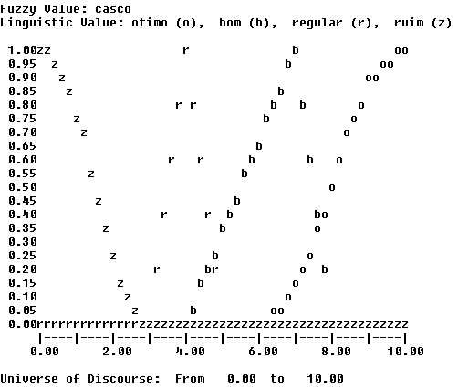

No template Motor, foi considerado as variáveis linguísticas como no template Casco, com a situação atual do Motor, porém com valores diferentes, e utilizou-se duas funções pré-definidas (z e s)  uma trapezóide e um triângulo:

```lisp
(deftemplate motor
0 10 nota_motor
     ((ruim (z 0 4))
        (regular (3 0)(5 1)(6 1)(7 0))
        (bom (5 0)(8 1)(9 0))
        (otimo (s 9 10))
    )
)
```
O código acima ilustra os valores numéricos possíveis para o Motor, considerando as variáveis linguísticas definidas na Tabela 1 e no template respectivo.

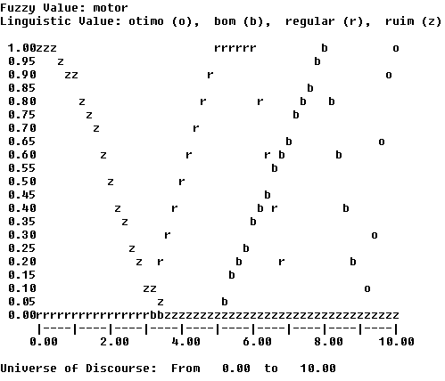

O último template, Avaliação utilizou-se duas funções pré-definidas (z e s) e dois trapezóides:

```lisp
(deftemplate avaliacao
0 800 valorBarco
    ((ruim (z 0 400))
        (medio (350 0)(500 1)(550 1)(560 0))
        (bom (550 0)(630 1)(680 1)(790 0))
        (otimo (s 750 800))
    )
)
```
O código acima ilustra os valores numéricos possíveis para a Avaliação, considerando os valores numéricos em milhares, sendo o resultado das variáveis linguísticas Motor e Casco. Podemos ver os valores no template respectivo.

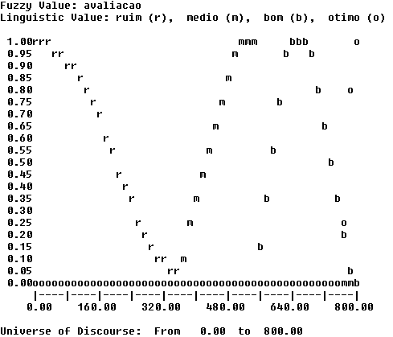

As regras que definirão a avaliação da lancha são colocadas em 4 regras distintas, uma para cada variável linguística para o valor da lancha. A utilização da declaração salience foi a solução adotada para garantir que essas regras fossem executadas ANTES da regra de defuzzificação;

```lisp
(defrule Otimo
    (declare (salience 10))
    (or 
     (and (casco otimo)
        (motor otimo))
     (and (casco regular)
        (motor otimo))
     (and (casco bom)
        (motor otimo)))    
=>
    (assert (avaliacao otimo))
)

(defrule Bom
    (declare (salience 10))
    (or (and (casco ruim)
        (motor otimo))
        (and (casco regular)
        (motor bom))
        (and (casco otimo)
        (motor ruim))
        (and (casco otimo)
        (motor bom))
        (and (casco bom)
        (motor bom))
        )
=>
    (assert (avaliacao bom))
)

(defrule Medio
    (declare (salience 10))
    (or (and (casco otimo)
        (motor ruim))
        (and (casco bom)
        (motor ruim))
        (and (casco regular)
        (motor regular))
        (and (casco otimo)
        (motor bom))
        (and (casco ruim)
        (motor bom))
        )
=>
    (assert (avaliacao medio))
)

(defrule Ruim
    (declare (salience 10))
    (or (and (casco regular)
        (motor ruim))
        (and (casco ruim)
        (motor ruim))
        (and (casco ruim)
        (motor regular))
    )
=>
    (assert (avaliacao ruim))
)
```

Para a defuzzificação, foi criada uma variável global e uma regra que também faz a plotagem do valor numérico encontrado. A regra ‘defuzificada’ foi declarada com salience 0 de forma a ser executada posteriormente as demais regras do sistema.

```lisp
(defrule defuzifica
    (declare (salience 0))
    ?v_tmp <- (avaliacao ?)
=>
    (bind ?*g_resultado* (moment-defuzzify ?v_tmp))
    (plot-fuzzy-value t "*" nil nil ?v_tmp)
    (retract ?v_tmp)
    (printout t "Valor recomendado: ")
    (printout t ?*g_resultado* )
    (printout t " mil reais" crlf)
    (printout t " >>> Término <<< " crlf)
)
```
Foram gerados valores através do deffacts, no sentido de testar as regras a obter os valores numéricos relacionados aos resultados. O código-fonte abaixo ilustra a utilização de valores para a situação do Motor e Casco.

```lisp
(deffacts avaliacao
    (casco otimo)
    (motor otimo)
)
```
Resultado:


A seguir os demais resultados com os valores contidos na [tabela](https://github.com/anologicon/faculdade-fuzzy-clips#tabela).

```lisp
(deffacts avaliacao
    (casco bom)
    (motor otimo)
)
```

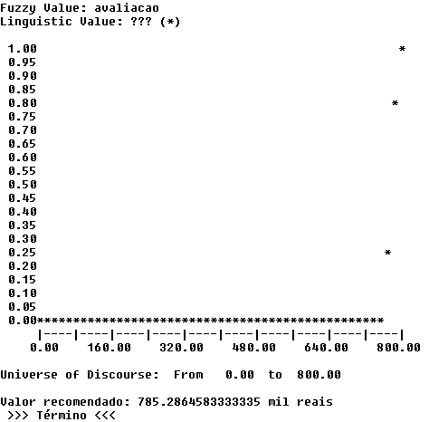

---

```lisp
(deffacts avaliacao
    (casco regular)
    (motor otimo)
)
```

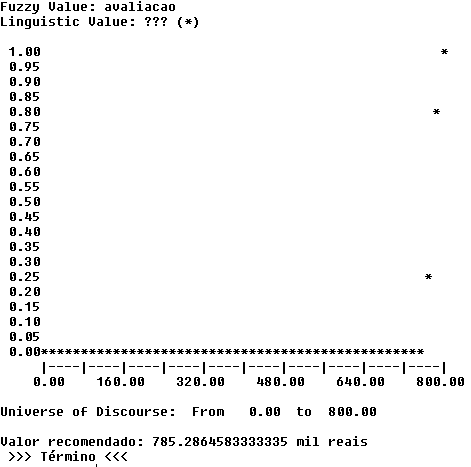

---

```lisp
(deffacts avaliacao
    (casco ruim)
    (motor otimo)
)
```

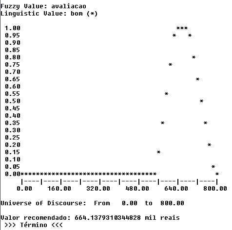

---

```lisp
(deffacts avaliacao
    (casco otimo)
    (motor bom)
)
```

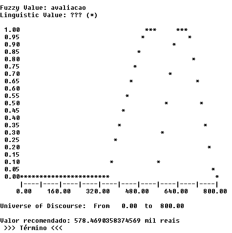

---

```lisp
(deffacts avaliacao
    (casco bom)
    (motor bom)
)
```

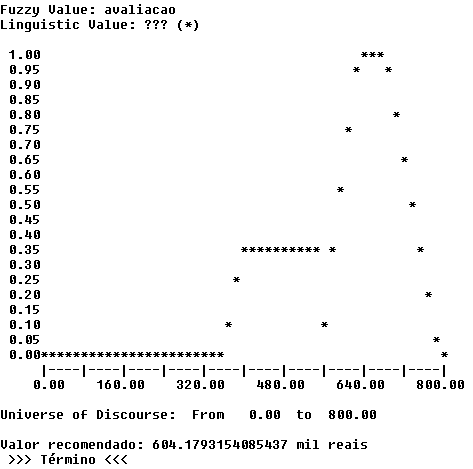

---

```lisp
(deffacts avaliacao
    (casco regular)
    (motor bom)
)
```

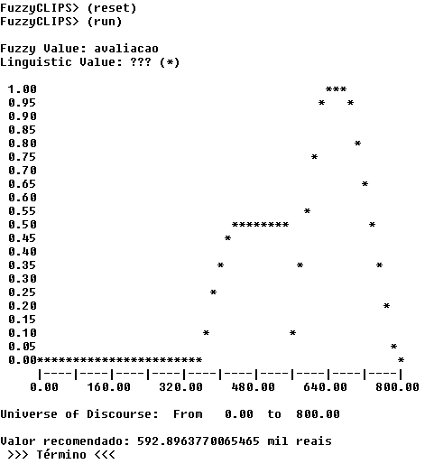

---

```lisp
(deffacts avaliacao
    (casco ruim)
    (motor bom)
)
```

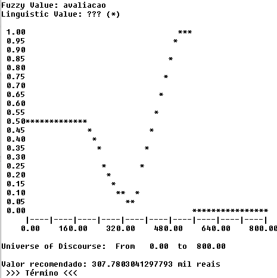

---

```lisp
(deffacts avaliacao
    (casco otimo)
    (motor regular)
)
```

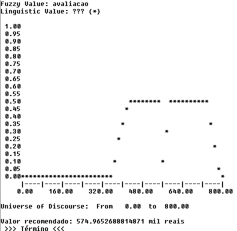

---

```lisp
(deffacts avaliacao
    (casco bom)
    (motor regular)
)
```

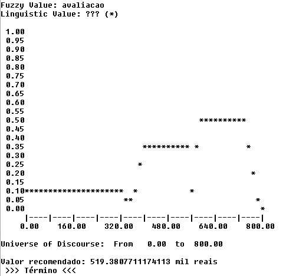

---

```lisp
(deffacts avaliacao
    (casco regular)
    (motor regular)
)
```

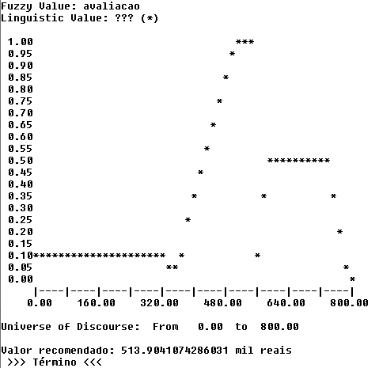

---

```lisp
(deffacts avaliacao
    (casco ruim)
    (motor regular)
)
```

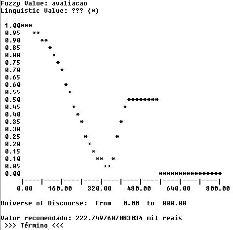

---

```lisp
(deffacts avaliacao
    (casco otimo)
    (motor ruim)
)
```

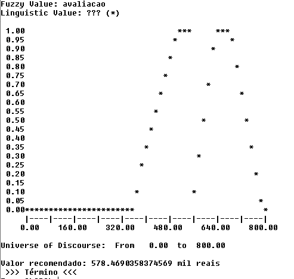

---

```lisp
(deffacts avaliacao
    (casco bom)
    (motor ruim)
)
```

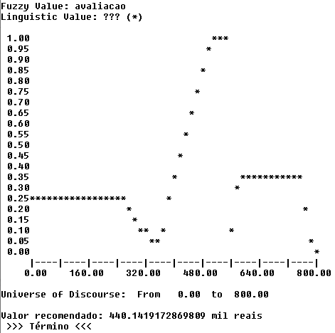

---

```lisp
(deffacts avaliacao
    (casco regular)
    (motor ruim)
)
```

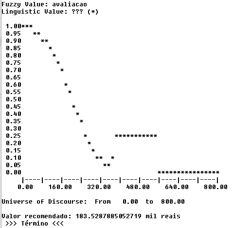

---

```lisp
(deffacts avaliacao
    (casco ruim)
    (motor ruim)
)
```

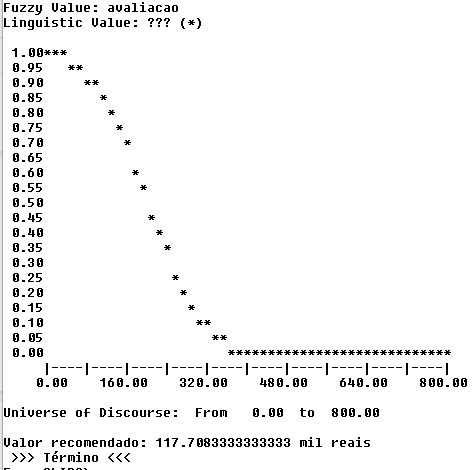

## 4. Conclusão

<p align="justify">
Vendo os resultados da plotagem e os modelos de dados pode-se ver a importância que o motor desta lanche tem em sua avaliação. No começo tentei fazer um sistema especialista mais amplo, porém falando com o especialista no assunto, percebi que em diferentes modelos de lanches a importância de um item no valor final da corretagem era diferente, então resolvi fazer um sistema especialista em vender apenas um tipo de lanche no modelo específico e ano específico.

De acordo com o especialista algumas outras variáveis teria deixado ainda mais apurado o sistema.

As regras foram usadas para deixar mais apurado o fato do motor ter mais relevância no preço.
</p>
